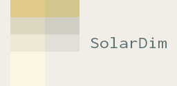
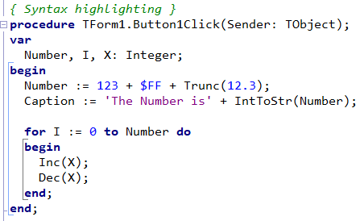
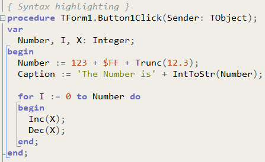

# SolarDim color theme for Embarcadero® Delphi

[← Back to parent repository](https://github.com/RDMCz/SolarDim)

* [What is this](#what-is-this)
* [Showcase](#showcase)
* [Installation](#installation)

## What is this

SolarDim is an IDE color theme that aims to strike a balance between typical _light_ and _solarized light_ IDE color themes. It is based around the color `#F0EEE6`: the "Light grayish yellow".

The pure white background of light color themes can be too straining on the eyes, while the colors of solarized light color themes can be too warm, especially if you use a software night screen filter or wear computer glasses. If you found out that you can navigate the code better when using a light theme, but the themes mentioned above are too white or yellow for you, you might want to give SolarDim a try.

## Showcase

Defaults|SolarDim
---|---
|

This theme currently changes just the editor colors and does not come with its own VCL style.

## Installation

1. Download and install [DITE](https://github.com/RRUZ/delphi-ide-theme-editor)
2. Download [_\_SolarDim.theme.xml_](./_SolarDim.theme.xml) from this repository and place it to `C:\ProgramData\DITE\Themes`
3. Open DITE and find the _\_SolarDim_ theme at the bottom of the themes list
4. Select the theme and click _Apply Theme_
5. Restart your IDE to apply changes

 

SolarDim is also available for [VS Code](https://github.com/RDMCz/SolarDim-VSCode) and [JetBrains IDEs](https://github.com/RDMCz/SolarDim-JetBrains).
